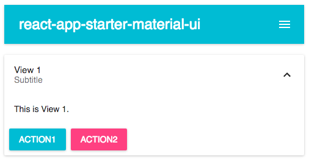

### react-app-starter-material-ui

A starter project for writing a react app with material-ui components.

Front-end stack:

- babel for latest JS language support
- react-router for UI layout and navigation
- material-ui for style and UI components
- browserify for commonjs modules
- watchify for incremental builds
- [live-server](https://github.com/tapio/live-server) for live reload during development

Usage:

```bash
$ npm install
$ npm start
```


